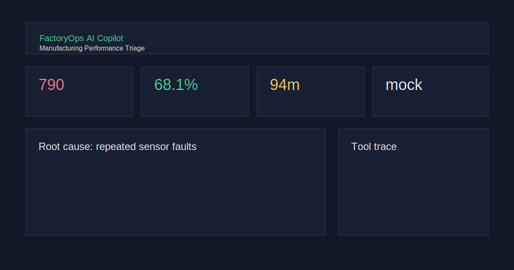
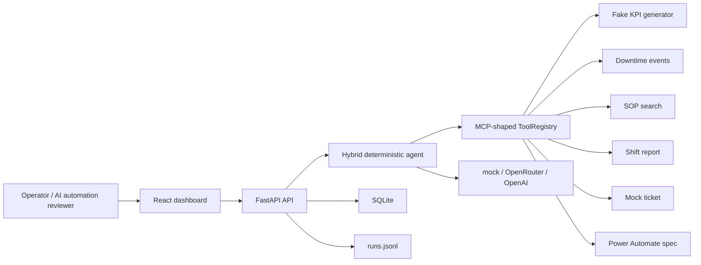

# FactoryOps AI Copilot

Professional local-first demo for an AI Automation Developer portfolio. FactoryOps AI Copilot looks and behaves like an internal manufacturing performance triage tool, but every KPI, downtime event, SOP, ticket, and automation spec is fake deterministic demo data.



## Why It Exists

Manufacturing teams often need answers that cross KPI tables, downtime logs, SOPs, shift reporting, maintenance workflows, and automation handoffs. This project demonstrates how an AI copilot can orchestrate reliable tools instead of acting like a random chatbot.

The core demo asks:

> Why did Line A underperform yesterday and what should we do next?

The app reads generated KPIs, checks downtime, compares the previous 7 days, searches SOP docs, identifies the root cause, generates a shift report, creates a mock maintenance ticket, drafts a Power Automate flow specification, logs every tool call, and persists the run to SQLite plus JSONL.

## Features

- Deterministic mock provider by default: no API key, no paid hosting, repeatable output.
- Optional OpenRouter and OpenAI providers through the OpenAI SDK-compatible abstraction.
- FastAPI backend with typed Pydantic v2 schemas and SQLite persistence.
- MCP-shaped tool registry with typed tool metadata and execution trace.
- React, TypeScript, Vite, Tailwind dashboard with static fallback mode.
- SQL safety guard for `query_factory_db`: SELECT-only, blocks writes and admin commands.
- Docker Compose, Makefile, pytest, ruff, frontend build, and GitHub Actions CI.

## Architecture



## Quick Start

```bash
cp .env.example .env
docker compose up --build
```

Open:

- Frontend: http://localhost:5173
- Backend: http://localhost:8000
- API docs: http://localhost:8000/docs

Local developer flow:

```bash
make test
make lint
make build
```

## Provider Setup

Default mock mode:

```env
LLM_PROVIDER=mock
```

OpenRouter:

```env
LLM_PROVIDER=openrouter
OPENROUTER_API_KEY=your_openrouter_key_here
OPENROUTER_MODEL=openai/gpt-4o-mini
```

OpenAI:

```env
LLM_PROVIDER=openai
OPENAI_API_KEY=your_openai_key_here
OPENAI_MODEL=gpt-4o-mini
```

Secrets are never hardcoded. `.env` is ignored by git. The UI only shows provider, model, latency, and token counts.

## Sample Output

Prompt:

```text
Why did Line A underperform yesterday and what should we do next?
```

Short answer:

```text
Line A underperformed because repeated sensor faults created 94 minutes of downtime, pushing output below the previous 7-day baseline. Inspect and recalibrate sensors, verify cabling and PLC timestamps, hold first-hour quality containment, and review the mock maintenance ticket at handover.
```

## Tools

- `get_production_kpis(line,date)`
- `get_downtime_events(line,date)`
- `compare_line_performance(line,date,days_back=7)`
- `search_sop(query)`
- `generate_shift_report(line,date,kpis,downtime)`
- `create_maintenance_ticket(line,issue,priority,evidence)`
- `create_power_automate_flow_spec(trigger,actions,target_users)`
- `query_factory_db(sql)`

The project includes `backend/app/mcp_server.py` as an MCP-shaped manifest entrypoint. It intentionally avoids claiming full MCP runtime support; the demo focuses on the registry shape, typed schemas, traceability, and safe orchestration.

## Safety And Privacy

- All data is generated fake portfolio data.
- No real employer, client, plant, system, or person names are used.
- The default provider is deterministic and offline-friendly.
- SQL tool rejects write/admin statements.
- CI runs with no API keys.

## Roadmap

- Add Playwright visual regression checks.
- Add richer SQL-backed fake factory tables.
- Add downloadable PDF shift report.
- Add real MCP server transport once it improves the demo rather than adding friction.
- Add optional GitHub Pages deployment for the static dashboard.

## LinkedIn Featured Text

Built FactoryOps AI Copilot, a local-first AI automation portfolio demo for manufacturing performance triage. It combines FastAPI, React, SQLite, typed tool orchestration, mock/OpenRouter/OpenAI providers, deterministic fake factory data, tool traces, generated shift reports, mock maintenance tickets, and Power Automate flow specs. Runs with Docker Compose and needs no API key by default.
